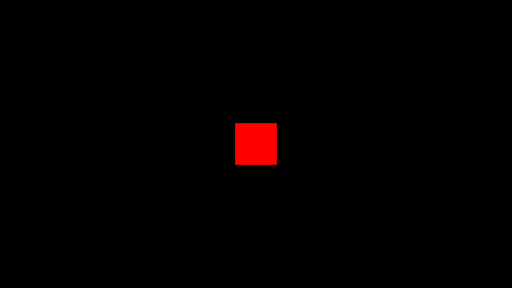
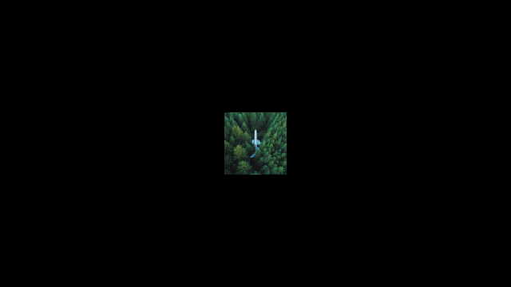

### [#00 - plane](./app00/index.html)

[codes](https://github.com/kenjiSpecial/tubugl-2d-shape/blob/master/examples/app00) | [Source for plane](https://github.com/kenjiSpecial/tubugl-2d-shape/blob/master/src/plane.js)

### [#01 - plane with vao](./app01/index.html)

[codes](https://github.com/kenjiSpecial/tubugl-2d-shape/tree/master/examples/app01) 

### [#02 - plane with texture](./app02/index.html)

[codes](https://github.com/kenjiSpecial/tubugl-2d-shape/tree/master/examples/app02) | [Source for texturePlane.js](https://github.com/kenjiSpecial/tubugl-2d-shape/blob/master/src/texturePlane.js)